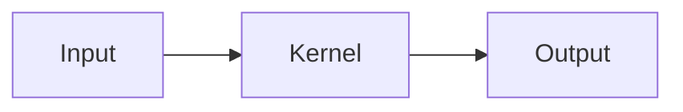

# MiyaaL.github.io

MiyaaL 的个人主页与技术博客，使用 GitHub Pages 原生支持的 Jekyll 构建。

站点地址：<https://miyaal.github.io>

## 功能

- 中文技术简约风，支持系统、浅色、深色三种主题模式
- 首页自动展示最近 6 篇文章
- Blog 归档支持标签筛选与本地关键词搜索
- Markdown、Rouge 代码高亮和一键复制
- 按文章启用 LaTeX 公式与 Mermaid 图表
- RSS、Sitemap、SEO 元数据和响应式布局
- 不依赖数据库、后端服务或前端框架

## 本地预览

本机只需安装 Docker：

```bash
docker compose up
```

首次运行会下载 Ruby 镜像并安装依赖。构建完成后访问
<http://localhost:4000>，修改文件会自动刷新。

如需同时预览 `_drafts/` 中的草稿，先至少运行一次上面的命令安装依赖，
然后使用：

```bash
docker compose run --rm --service-ports site \
  bundle exec jekyll serve --host 0.0.0.0 --livereload --force_polling --drafts
```

## 写一篇新文章

已发布文章位于 `_posts/`，文件名必须使用：

```text
YYYY-MM-DD-英文短名.md
```

可以从 `_drafts/template.md` 复制，文章头部格式如下：

```yaml
---
title: "文章标题"
date: 2026-07-30 12:00:00 +0800
description: "用一句话说明文章解决的问题。"
tags: [CUDA, 性能优化]
math: false
mermaid: false
---
```

其中 `title`、`date`、`description`、`tags` 是常用字段。只有文章包含公式时才将
`math` 改为 `true`，只有包含 Mermaid 图表时才将 `mermaid` 改为 `true`。

### 草稿

草稿放入 `_drafts/`，发布时再移动到 `_posts/YYYY-MM-DD-英文短名.md`。
这是 Jekyll 的原生草稿机制，可以保证 GitHub Pages 不会生成草稿详情页。

### LaTeX 公式

先在文章元数据中设置 `math: true`，然后使用：

```markdown
行内公式：$E = mc^2$

$$
\operatorname{softmax}(x_i) = \frac{e^{x_i}}{\sum_j e^{x_j}}
$$
```

### Mermaid 图表

先设置 `mermaid: true`，再使用 Mermaid 代码块：

````markdown

````

### 图片

文章图片统一放入 `assets/posts/<文章短名>/`：

```markdown

```

优先使用 WebP 或经过压缩的 PNG，并始终填写有意义的图片说明。

## 发布

首次发布前，在 GitHub 创建一个名为 `MiyaaL.github.io` 的公开空仓库，不要额外生成
README、`.gitignore` 或许可证。本地仓库已经配置 SSH 远端，之后执行：

```bash
git push -u origin main
```

在 GitHub 仓库的 **Settings → Pages** 中，将来源设为 **Deploy from a branch**，
分支选择 **main**，目录选择 **/(root)**。以后新增文章只需：

```bash
git add _posts assets/posts
git commit -m "post: add article title"
git push
```

## 主要目录

```text
.
├── _drafts/          # 尚未发布的文章
├── _includes/        # 可复用页面片段
├── _layouts/         # 页面和文章模板
├── _posts/           # 已发布 Markdown 文章
├── assets/
│   ├── css/          # 站点样式
│   ├── icons/        # 图标
│   ├── js/           # 主题、搜索、代码复制和 Mermaid
│   └── posts/        # 文章图片
├── blog/             # Blog 归档页
├── _config.yml       # 站点配置
└── index.html        # 首页
```

## 许可

站点源代码与主题使用 [MIT License](LICENSE)。`_posts/`、`_drafts/` 和
`assets/posts/` 中的原创文章与媒体内容保留全部权利，详见
[CONTENT-LICENSE.md](CONTENT-LICENSE.md)。
